# 🧠 The Human CNN: The Pattern Decoder Game

> **A hands-on board game that teaches kids how Convolutional Neural Networks see the world — one stamp at a time.**

---

## 🎯 What Is This Game?

**"The Human CNN"** is a two-player educational board game that transforms the abstract math of a **Convolutional Neural Network (CNN)** into a tangible, physical experience.

To a human, spotting a house in a forest feels instant. But for a CNN, it's a rigorous pipeline: break the image into tiny pieces, scan for edges, combine edges into shapes, and finally classify the object. This game makes every step of that pipeline something you can *touch*, *stamp*, and *see*.

No coding required. No screen needed. Just two players, some stamps, and a stack of transparent sheets.

---

## 📦 Game Components

| Component | Description |
|---|---|
| **Game Base** | A two-layer frame with slots for the World Image (bottom), Feature Sheets (middle), and a sliding top cover with a small **window** (the Receptive Field) |
| **World Image** | A complex A4 drawing (e.g., a forest with a house, a city with cars) |
| **Feature Sheets A, B, C** | 3 transparent overlay sheets — **A** (Vertical lines), **B** (Horizontal lines), **C** (Diagonal lines) |
| **Result Sheet D** | 1 final sheet where combined patterns are recorded |
| **Symbol Stamps** | Stamps for marking detected features (▮, ▬, ╲, ◻, △) |
| **Logic Card** | The "Codebook" — a lookup table that maps pattern combinations to object names |

---

## 👥 Player Roles

```
┌─────────────────────────────────────────────────────────────┐
│                                                             │
│   Player 1: THE ENCODER          Player 2: THE CLASSIFIER   │
│   ─────────────────────          ─────────────────────────  │
│   Acts as the EARLY layers       Acts as the DEEP layers    │
│   of the CNN.                    and the OUTPUT.            │
│                                                             │
│   • Scans the raw image          • Receives feature maps    │
│   • Extracts edges & lines       • Finds complex shapes     │
│   • Creates feature maps         • Classifies the object    │
│                                                             │
└─────────────────────────────────────────────────────────────┘
```

---

## 📜 How to Play

### Step 1 — Target Selection *(Player 1)*

Player 1 studies the **World Image** and secretly picks one object to identify (e.g., the House). They **do not** reveal their choice to Player 2.

### Step 2 — Feature Extraction *(The Convolution)*

Player 1 creates the "data" for Player 2 using the sliding window:

1. Place **Feature Sheet A** (Vertical) over the World Image inside the base.
2. Slide the window to the **top-left corner**.
3. **The Rule:** Look *only* through the window. If you see a **vertical line**, stamp a **▮** in the center of that window position.
4. Move the window one step at a time (the **Stride**) until the entire image has been scanned.
5. **Repeat** with **Sheet B** (stamp **▬** for horizontal lines) and **Sheet C** (stamp **╲** for diagonal lines).

### Step 3 — Pattern Detection *(Player 2)*

Player 1 hands the three stamped sheets to Player 2, who now "processes" the data:

1. **Find Corners:** Overlay Sheet A and Sheet B. Wherever a **▮** and a **▬** appear in the same (or touching) grid square → stamp a **◻** on the **Result Sheet D**.
2. **Find Peaks:** Look at Sheet C. Wherever two diagonal marks meet at the top → stamp a **△** on the **Result Sheet D**.

### Step 4 — The Big Reveal *(Classification)*

Player 2 compares their **Result Sheet D** to the **Logic Card**:

| Pattern Found | Object |
|---|---|
| **3+ Squares (◻)** + **1 Peak (△)** | 🏠 **HOUSE** |
| **4 Circles** + **1 Large Rectangle** | 🚗 **CAR** |
| **3 Circles** + **2 Triangles** | 🐱 **CAT** |

✅ **Win condition:** If Player 2 correctly names the object Player 1 was thinking of, the "Model" is accurate!

---

## 🛠️ The Golden Rules

| Rule | What It Means |
|---|---|
| **The Window Constraint** | You may **only** look through the small window — never at the whole image. If you can't see the full shape, that's okay — *the network doesn't either!* |
| **The Center-Stamp Rule** | Always stamp in the **dead center** of the window so symbols align correctly when sheets are stacked. |
| **The Max-Pooling Grace** | If two symbols are "very close" but not perfectly touching, Player 2 can still count them as a match — this represents the *fuzziness* of AI. |

---

## 🚀 Pro-Level Variation: "Out of Distribution"

Once the Logic Card is mastered, try identifying an object that **isn't listed**. Player 2 must describe the new patterns they see and *"train"* a new entry for the Logic Card.

> *Example: "I found 2 vertical lines and a circle — I think it's a* 🌳 *TREE!"*

This mirrors what happens in real AI when a model encounters data it was never trained on.

---

## 🔬 How the Game Maps to a Real CNN

Every game action has a direct counterpart in Convolutional Neural Network architecture. Here's the full breakdown:

### 1. The World Image → Input Tensor

The A4 drawing is the game's "raw data." In a real CNN, an image is just a grid (matrix) of numbers representing pixel brightness (0–255). Just as Player 1 doesn't "understand" the forest yet, the computer starts with only raw numbers. The goal: turn those numbers into a label like *"House."*

### 2. The Sliding Window → Receptive Field & Convolution

A CNN never looks at the whole image at once — too much data. Instead, it slides a small window across the image, focusing on **local patterns**. By scanning everywhere, the network gains **Translation Invariance**: it can find a house whether it's in the top-left corner or the bottom-right.

### 3. Player 1 & The Stamps → Kernels + ReLU Activation

When Player 1 looks for vertical or horizontal lines, they act as a **Convolutional Filter (Kernel)** — a small matrix of weights. When the kernel's pattern matches the image strongly, it produces a high output (a "Yes!"). The stamp itself is the **Activation Function (ReLU)**: *"If the pattern is strong enough, pass the signal forward. If not, leave it blank."*

### 4. The Transparent Sheets → Feature Maps (Channels)

After scanning, Player 1 has three separate sheets — one per feature type. These are **Feature Maps**. A CNN creates many parallel "views" of an image: one highlighting edges, another curves, etc. Sheet A is the "Vertical Channel," Sheet B the "Horizontal Channel," and so on.

### 5. Player 2 & Overlays → Hidden Layers (Hierarchical Learning)

This is where the **"Deep"** in Deep Learning comes from. Player 2 never sees the original image — only the feature maps produced by Player 1.

```
Layer 1 (Player 1)    →    finds simple edges  (▮, ▬, ╲)
Layer 2 (Player 2)    →    combines edges into shapes  (◻, △)
```

> **Key Insight:** AI learns that a "Square" is just a "Vertical Line" AND a "Horizontal Line" in the same place.

### 6. The "Close Enough" Rule → Max Pooling

Player 2 is allowed to count marks as matching even if they're not perfectly aligned. This mirrors **Max Pooling**, which reduces spatial sensitivity: *"I don't care exactly which pixel the corner is on, as long as a corner exists in this general area."* This makes the AI robust to small translations and rotations.

### 7. The Logic Card → Fully Connected Layer (Softmax)

The final lookup step maps detected features to class labels — exactly like the **Classification Layer** in a CNN. After all scanning and shape-finding, the network feeds its feature counts into a function that outputs probabilities:

> *"I am 98% sure this is a House."*

---

## 🗺️ Full CNN Pipeline — Game vs. Network

```mermaid
flowchart LR
    A["🖼️ World Image<br/><i>Input Tensor</i>"] --> B["🔍 Sliding Window<br/><i>Convolution + Stride</i>"]
    B --> C["✍️ Stamps on Sheets A,B,C<br/><i>Kernels + ReLU</i>"]
    C --> D["📂 3 Feature Sheets<br/><i>Feature Maps</i>"]
    D --> E["🧩 Player 2 Overlays<br/><i>Hidden Layers</i>"]
    E --> F["📍 Close-Enough Rule<br/><i>Max Pooling</i>"]
    F --> G["🗂️ Logic Card Lookup<br/><i>FC Layer + Softmax</i>"]
    G --> H["🏷️ Object Name<br/><i>Classification Output</i>"]
```



---

## 📊 Quick Reference Table

| Game Action | CNN Technical Term |
|---|---|
| Sliding the window cover across the image | **Convolution / Stride** |
| Stamping a symbol when a pattern is found | **Kernel Convolution + ReLU Activation** |
| Creating separate sheets for ▮, ▬, ╲ | **Feature Maps / Channels** |
| Stamping ◻ when ▮ and ▬ overlap | **Higher-Level Feature Detection (Hidden Layers)** |
| Accepting "close enough" matches | **Max Pooling** |
| Looking up the Logic Card to name the object | **Fully Connected Layer / Softmax Classification** |

---

## 📁 Repository Structure

```
L38_HomeWork/
├── README.md                          # This file
└── משחק_מפענח_התבניות.mp4             # Game demo video
```

---

## 🎓 Educational Context

This game was designed as a teaching tool to make the core concepts of **Convolutional Neural Networks** accessible to young learners. By physically performing each step of the CNN pipeline — convolution, activation, feature mapping, pooling, and classification — players build an intuitive understanding of how AI "sees" before ever writing a line of code.

---

*Built with ❤️ for curious minds who want to understand AI from the ground up.*
